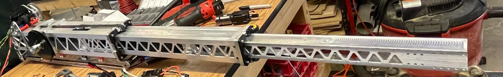

# FRC_Robotics_Design_Portfolio

## Overview
This repository showcases select CAD designs from my leadership in First Robotics Competition (FRC) from 2020 to 2024, where I led design teams to a top 0.3% global ranking (13th out of over 3,500 teams). These projects demonstrate mechanical design, systems integration, and problem-solving skills relevant to aerospace and systems engineering. All designs created in Onshape; screenshots provided due to team file-sharing restrictions.

---

### Key Skills Demonstrated
- CAD Modeling (Onshape)
- Mechanical Design and Optimization
- Systems Engineering and Assembly Integration
- Leadership in High-Pressure Build Seasons (500+ hours/season)

---

## Climber Mechanism (2022 FRC Robot)
**Description:** Redesigned offseason climber mechanism for Rapid React in the FRC 2022 season, optimizing pivot resiliency and telescoping speed. Led CAD iterations, reducing weight by 15% while ensuring compatibility with the robot chassis. Enabled 4-second climb time, contributing to the team's 13th global ranking.

**Screenshots/Photos:**

Climb Video: https://youtube.com/shorts/hbTMuiDt9p0?si=rs9C6EKQXDx-BxyF

---

## Shooter and Wrist Subsystem (2024 FRC Robot)
**Description:** Led the design of a shooter and wrist subsystem in OnShape for the FRC 2024 season, overcoming limited team resources. Applied systems engineering to integrate wiring, game piece handling, and collector-to-shooter handoffs, achieving a 50 ft range and over 20 m/s velocity with 115-degree wrist mobility. Enabled three scoring methods through precise design, contributing to the team’s top 1% global ranking in 2024.

**Screenshots/Photos:**

---

## Bearing Block Parts (2023 FRC Robot)
**Description:** Designed precise and tight-fit upper and lower bearing blocks (4 total), that housed over 60 bearings for a smooth translational telescoping arm. Each block was manufactured on a CNC and never had to be replaced for over 100 matches.

**Screenshots/Photos:**

---

## Collector and Wrist Mechanism (2023 FRC Robot)
**Description:** Redesigned offseason collector for faster collection speeds, durability, weight, and poseability. Led CAD motion on iterations, speeding up collect time by more than a second per cycle (which added up over a 135-second match), and the wrist was far more durable than previous competitions.

**Screenshots:**

---

## Future Enhancements
Planning to add STL exports if permissions allow. Contact me for more details!
